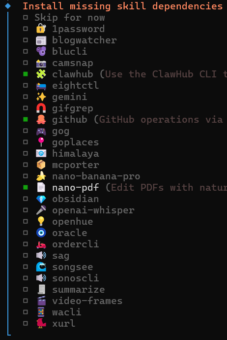
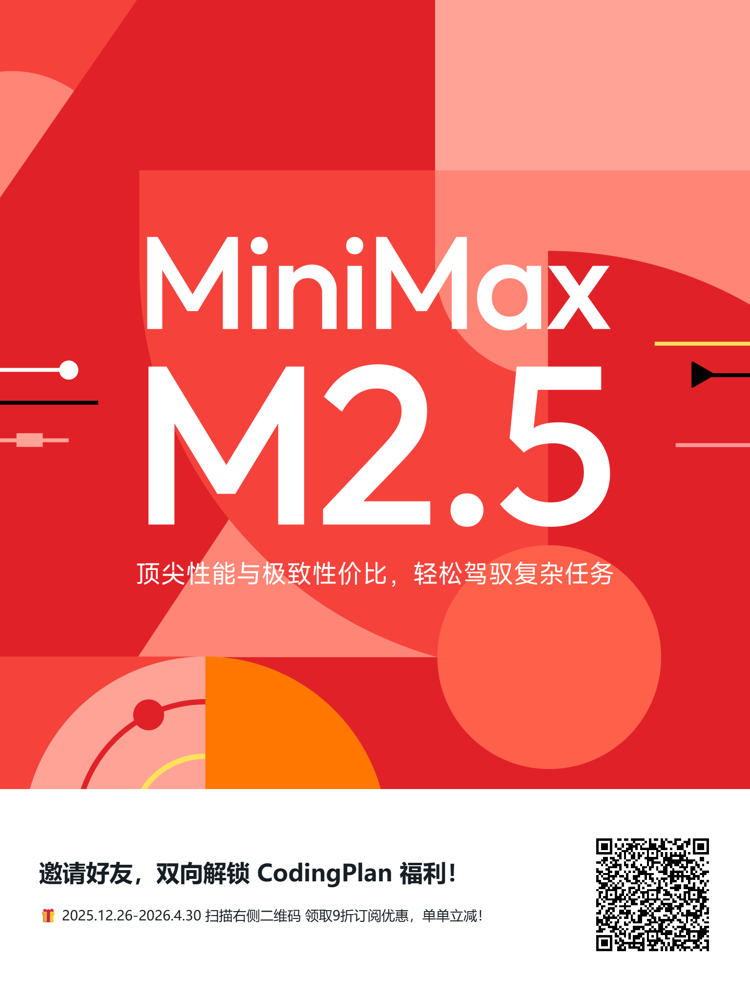

# 快速设置

这页只讲一个原则：**先把大模型 API Key 配好，让 OpenClaw 跑起来；其他配置随后再追加**。
目标是先跑通核心链路，避免一上来就卡在渠道/高级网络等细节上。
这里有一个重要原因就是，其他的设置onboard的交互不合理，特别是渠道设置，不仅繁琐，而且由于渠道众多无法面面俱到，结果就是不好用。

::: danger 重要提醒（必须看）
不要通过手动编辑 `~/.openclaw/openclaw.json` 来“硬改配置”。
onboard 不只会改一个 json，还会联动其他状态与关联文件。只手改 json 很容易把环境改坏，导致后续启动或渠道配置异常。

结论：配置请走 `openclaw onboard` / `openclaw configure` / Control UI，不要走手改 json。
:::

## 什么时候需要手动执行 onboard

如果你是通过 `curl -fsSL https://openclaw.ai/install.sh | bash` 安装的，安装流程通常会在最后直接进入一次 `onboard` 的快速设置。

- **你已经完成过一次快速设置**：一般不需要再执行 `openclaw onboard`
- **你当时跳过了/中途退出了**：再手动跑一次 `openclaw onboard` 即可

## Docker 用户不会进入容器的先看这里

::: warning 特别提醒
不建议通过 NAS 的 Web Shell 进入容器。特别是飞牛等国产 NAS 场景，Web Shell 常见分辨率或终端兼容问题，可能导致二维码无法正常显示。
而 QQ / 飞书当前很多快速设置依赖扫码授权，如果二维码显示异常，就会卡在初始化阶段。

建议使用 Windows/macOS/Linux 原生终端，通过 SSH 连接 NAS 后再执行 Docker 命令。
:::

::: details 展开查看 Docker 容器定位与命令（按需）
你需要区分两个容器名：

- `openclaw-gateway`：网关服务容器
- `openclaw-cli`：命令行容器

先确认容器名（推荐）：

```bash
docker ps --format "table {{.Names}}\t{{.Image}}\t{{.Status}}" | grep -E "openclaw-gateway|openclaw-cli"
```

如果你是 Docker Compose 部署，也可以在 `docker-compose.yml` 里看：

- `services` 下的服务名
- 或每个服务里的 `container_name`

也可以直接看 Compose 运行态：

```bash
docker compose ps
```

进入 CLI 容器：

```bash
docker exec -it openclaw-gateway bash
```

一次性快速 CLI 设置（如果你首次安装时已做过快速设置，这一步可以跳过）：

```bash
docker exec -it openclaw-cli openclaw onboard
```
:::

## 设置大模型 API Key

这里先说明我为什么推荐 [MiniMax](https://platform.minimaxi.com/subscribe/coding-plan?code=5LsgdBfFcO&source=link)（基于当前实战体验）：

1. **市场选择（看全球流量）**：按媒体引用的 OpenRouter 统计口径，不同时间窗口里头部模型有明显变化，但 [MiniMax](https://platform.minimaxi.com/subscribe/coding-plan?code=5LsgdBfFcO&source=link) 一直在第一梯队
   - 周口径（2026-03-02～03-08）：Top 5 里有 [MiniMax M2.5](https://platform.minimaxi.com/subscribe/coding-plan?code=5LsgdBfFcO&source=link)、Kimi K2.5、[GLM-5](https://www.bigmodel.cn/glm-coding?ic=GZM9E01DLP)、DeepSeek V3.2
   - 排名会波动，但 [MiniMax](https://platform.minimaxi.com/subscribe/coding-plan?code=5LsgdBfFcO&source=link) 在 OpenClaw 生态下长期处于高使用量梯队
   - 当然也推荐 [GLM](https://www.bigmodel.cn/glm-coding?ic=GZM9E01DLP)，这是目前国产编程模型第一名，但是好用也意味着昂贵（pro包年 ￥1430.4，max包年 ￥4502.4），官方的 [GLM-5-Turbo](https://www.bigmodel.cn/glm-coding?ic=GZM9E01DLP) 是一个不错的选择，目前只有 **max** 和 **pro** 用户可以使用，是一个专为龙虾设计的模型，如有需要，务必联系我评估，不要轻易尝试。
2. **省钱**：当然我们是和glm以及国际领先模型对比， MiniMax 成本更便宜，且在 OpenClaw 生态下长期处于高使用量梯队，而且是第一家出来支持龙虾的模型
3. **复杂任务友好**：按prompt计费而不是按照token计费，对长 prompt、复杂指令链的响应更顺，适用于有生产需求的场景
4. **对比 Kimi / 千问**：在我当前工作流里，[MiniMax](https://platform.minimaxi.com/subscribe/coding-plan?code=5LsgdBfFcO&source=link) 的综合体验更平衡

数据参考（实时会变化）：

- OpenRouter 排行入口：https://openrouter.ai/rankings
- 新浪新闻（引用 OpenRouter 日榜/月榜数据）：https://www.sina.cn/news/detail/5275245922748686.html

## 普通用户套餐建议（[MiniMax](https://platform.minimaxi.com/subscribe/coding-plan?code=5LsgdBfFcO&source=link)）

普通用户建议优先考虑下面两档包月/包年：

**Starter**

- 适合入门级开发场景，满足基础开发需求
- 价格：￥29 / 月（按月订阅），￥290 / 年（包年订阅）
- 配额：600 次模型调用 / 5 小时
- 模型：支持最新 [MiniMax M2.7](https://platform.minimaxi.com/subscribe/coding-plan?code=5LsgdBfFcO&source=link)，正常约 50 TPS，低峰时段约 100 TPS

**Plus**

- 适合专业开发场景，满足复杂开发任务需求
- 价格：￥49 / 月（按月订阅），￥490 / 年（包年订阅）
- 配额：1500 次模型调用 / 5 小时
- 模型：支持最新 [MiniMax M2.7](https://platform.minimaxi.com/subscribe/coding-plan?code=5LsgdBfFcO&source=link)，正常约 50 TPS，低峰时段约 100 TPS
- 用量：约为 Starter 的 2.5 倍

选型建议：

- 轻度到中度使用：先上 Starter
- 每天高频使用、复杂任务多：直接 Plus
- 明显超过 Plus 用量：升级更高档套餐，并保留 DeepSeek 按量 fallback

在 `onboard` 向导里，重点只盯住“API Key”这一段，其它能跳过就先跳过。

你会依次看到类似下面这些选择（不同版本文字可能略有差异）：

- 同意个人默认配置提示
- 选择模式：`QuickStart(快速设置)`
- 选择模型/认证提供商（你用哪家就选哪家）
- 认证方式：选择 `API Key`
- 粘贴 API Key（这一步最关键）
- 选择默认模型（不确定就先用默认推荐）

[MiniMax 控制台（获取 API Key）](https://platform.minimaxi.com/user-center/basic-information/interface-key)

进入向导后按这个策略选：

- 模型与认证：先把大模型 API Key 配好
- 其他项（渠道、高级网络、额外技能、复杂参数）：能跳过就全部跳过

## 选择技能（普通用户建议）

如果向导里出现“选择技能”，普通用户只选第一个就够用：**去官网搜索安装技能的命令**。

理由很简单：你真正需要的技能往往是后面用着用着才知道缺什么；而“会安装技能”是所有扩展能力的入口。把这一个先选上，后面你只要能把命令复制出来跑通，技能体系就能随用随装。



## 为什么这样做

- 新手阶段最容易卡死在“想一次配完所有东西”
- 先保证核心链路可用，再逐步补配置，成功率更高
- 后续细化配置统一用：

```bash
openclaw configure
openclaw dashboard
```

## 重启

<RestartGatewaySnippet />


## 🎁 [MiniMax 9折福利](https://platform.minimaxi.com/subscribe/coding-plan?code=5LsgdBfFcO&source=link)

- 立即参与：[MiniMax Coding Plan 邀请链接](https://platform.minimaxi.com/subscribe/coding-plan?code=5LsgdBfFcO&source=link)

<a href="https://platform.minimaxi.com/subscribe/coding-plan?code=5LsgdBfFcO&source=link" target="_blank" rel="noopener noreferrer">
  
</a>
