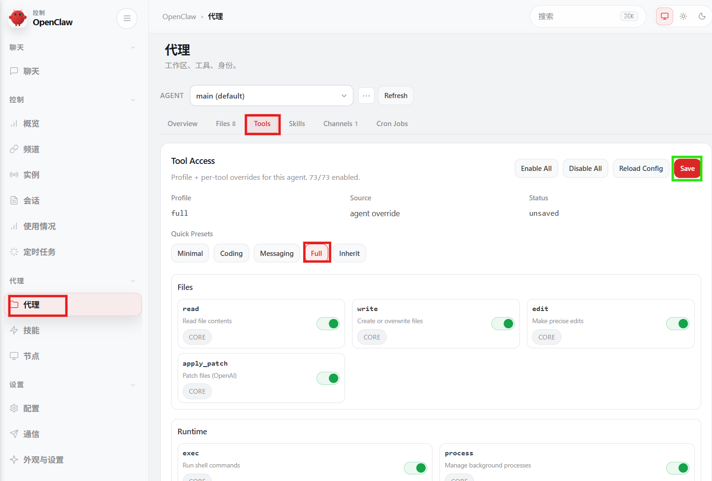

# 让龙虾飞

这篇只讲一条主线：先把能力层级设对，再做其他细节。  
对多数用户来说，**把能力切到 `full` 是一切的开端**。

::: tip Docker 用户入口
如果你是 Docker 部署，请先看 [快速设置（Docker 进入方式 + 一次性 CLI）](./quick-start.md)。
:::

## 一、开放full权限

### 非 Docker 命令

```bash
openclaw config set tools.profile full
openclaw config get tools.profile
```

### Docker 命令

```bash
docker exec -it openclaw-cli openclaw config set tools.profile full
docker exec -it openclaw-cli openclaw config get tools.profile
```

如果输出是 `full`，说明核心能力层级已经到位。

::: details Control UI（补充，默认收起）
⚠️ 必须有桌面环境  
Control UI 建议在有桌面浏览器的设备上完成（Windows / macOS / Linux 桌面端都可以）。  
如果你只在纯命令行环境里操作，体验会明显变差，也更容易漏掉关键开关。


:::

::: warning 安全提醒
把能力设置为 `full`，建议仅在沙盒环境（Docker / WSL2 / VMware）下使用。  
在沙盒里这样设置通常是安全可控的；如果是主系统裸跑，请先完成隔离再放开能力。
:::

## 二、重启

<RestartGatewaySnippet />

## 三、为什么先改这个

- `tools.profile` 决定了工具能力上限
- 不先设成 `full`，很多“你以为能做”的动作会被限制
- 后面你需要执行命令，你可以把命令发给龙虾它就能执行

简单理解：

- `full`：完整能力模式，适合你要让 OpenClaw 真正干活
- 其它更保守模式：更安全，但能力会被明显收窄
  * Minimal	→ 最少工具
  * Coding → 写脚本并运行脚本
  * Messaging → 对话，这就是原始的能力
  * Full → 以上所有能力外再加运行命令的能力
  * Inherit -> 子agent继承父agent(一般情况下我们还是要限制的)


## 四、其他

1. TUI (TerminalUi)为无图形能力的终端提供交互配置入口[入口命令：`openclaw tui`]

2. doctor 龙虾生病或者进入ICU时的手段，参考[诊断龙虾](./refrences/diagnose-lobster.md)

3. [官方参考](https://docs.openclaw.ai/zh-CN)
